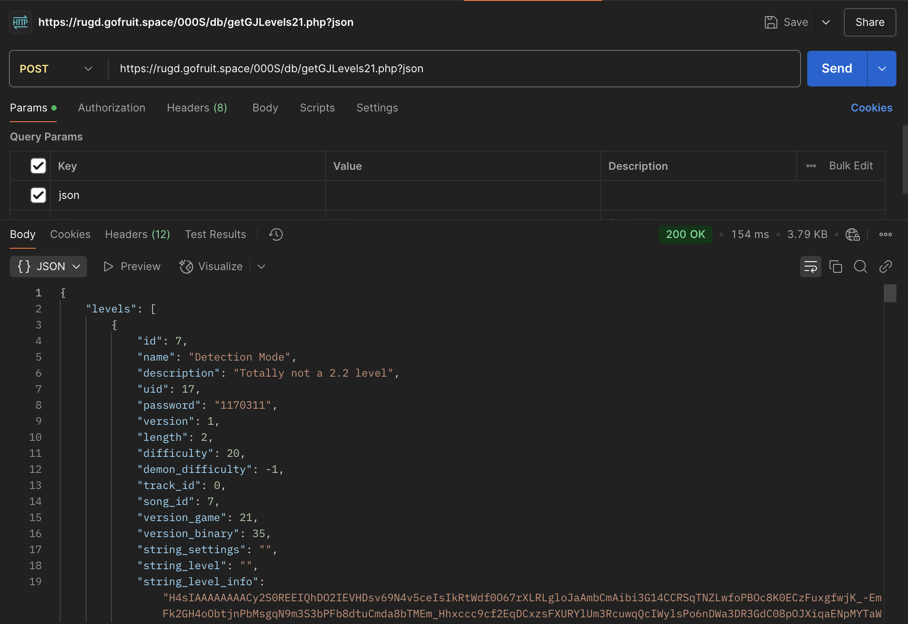
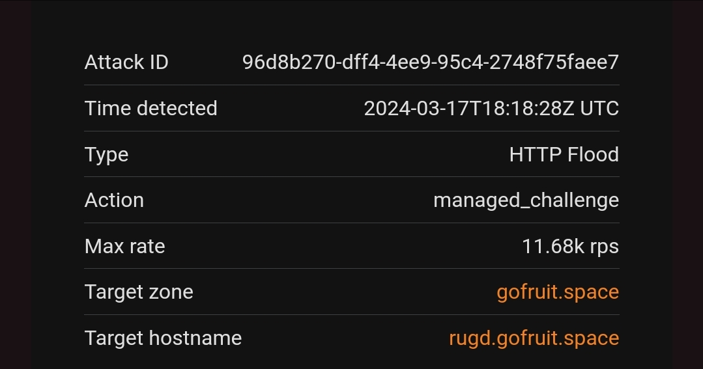

# M41den's GDPS GhostCore

Yeah, that legendary GDPS core written in go

## 🔥 Features
> ### 🧑‍💻 Full JSON support for all endpoints
> Just add `?json` URL parameter to endpoint and work with pure json without needing to parse RobTop's horror
> 

> ### ⚡ Fast As F*ck
> 🤓 Just being written in Go makes it 8-15x faster than Cvolton's implementation. 
> 
> 📦 It can be easily packaged into a tiny alpine container and deployed anywhere
> 
> 🚀 ...and then scaled to infinity thanks to optimized queries and caching.
> 
> 💪 DDoS? I don't care — here is how many rps 3 GhostCore instances were able to handle thanks to optimization 
> and IP reputation system "Ballistics":
> 
> (We had even 100k+ rps, but it wasn't on GhostCore itself so who cares)

> ### 🤗 Code quality is just GOOD
> Sane OOP, clean code, separate api and logic packages, connectors and other goodies make code easy to read and maintain

> ### ☁️ Cloud-native
> Distributed locks and leader election thanks to Consul, S3 savedata storage and Redis cache makes it easy to scale
> 

> ### 🙃 Just steal the code already!
> ✨ This core is optmized, easily maintainable and battle-tested on real GDPS hosting [FruitSpace](https://fruitspace.ru) 
> — 20K servers is not a joke. 
> 
> 🚀 It's built specifically to scale to 100K+ servers with minimal memory footprint of 40MB and near-zero CPU usage in idle.
> 
> 😭 "Oh no! It has license and now I'm obligated to mention that my project uses this code!" — bruh how would I know?

---
## 🔥 Фичи - RU 🇷🇺
> ### 🧑‍💻 Полная поддержка JSON для всех эндпоинтов
> Просто добавь `?json` к URL эндпоинта и работай с красивым JSON без необходимости работать с кошмаром РобТопа
> 
> 

> ### ⚡ Охренически быстрически
> 🤓 Сам факт того, что ядро написано на Go уже делает его в 8-15 раз быстрее, чем решение Cvolton'а.
>
> 📦 Ядро можно легко запаковать в легковесный alpine-контейнер без лишних зависимостей и размещать где угодно
>
> 🚀 ...а затем еще и масштабировать до бесконечности благодаря оптимизированным запросам и кэшированию
>
> 💪 DDoS'еров спросить забыли — вот столько RPS могут выдержать 3 инстанса GhostCore благодаря бесчисленным оптимизациям
> и системе репутации IP "Ballistics":
> 
> 
> 
> (Еще у нас был DDoS 100k+ rps, но не на само ядро, поэтому пропустим этот момент)

> ### 🤗 Наконец-то НОРМАЛЬНОЕ качество кода
> Адекватное ООП, читаемый код, разделение api и логики, коннекторы и прочие вкусности делают код легко читаемым и 
> обслуживаемым

> ### ☁️ Cloud-native
> Распределенные мьютексы и поддержка лидера/кворума благодаря Consul, S3 для хранения пользовательских сохранений и 
> кэш Redis позволяют легко масштабировать ядро. Добро пожаловать в будущее, PHP-шеры
> 
> 

> ### 🙃 Да просто своруйте уже код!
> ✨ Это ядро оптимизировано, легко в обслуживании и было отполировано за 2 года работы GDPS хостинга [FruitSpace](https://fruitspace.ru)
> — 20K серверов и Дольфи на борту это вам не шутки.
>
> 🚀 Ядро специально было сделано для масштабирования под 100К+ серверов с минимальным использованием RAM под 40MB и 
> почти нулевым использованием CPU во время бездействия.
>
> 😭 "О нет! У проекта есть лицензия и я теперь должен упомянать этот репозиторий!" — а будто раньше код у меня не копипастили

### Почемууу забросил ядрооо
Потому что роб забросил гд, но я оказался быстрее и забросил его в январе 2024. Не, серьезно - пора уже вам самим писать
нормальный код. Вам исходики, мне звездочку на репозиторий и плюсик на собесе.

Форкнуть или делать PR — я был бы рад пулл реквестам и мерджил их, если качество кода лучше ChatGPT. 

Если вам что-нибудь придет в голову или вы захотите интеграций, пните меня в телеге [👉@M41den](https://t.me/m41den)
и скажите что вы по поводу ядра (мысли ваши читать, увы, не умею).

